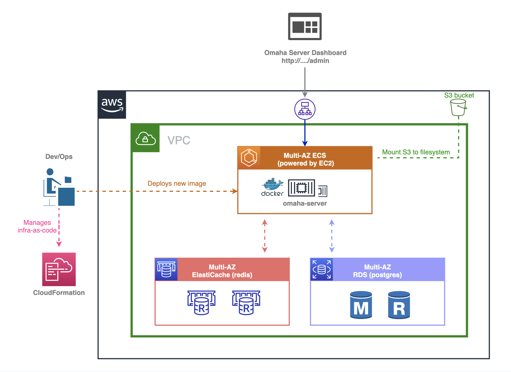

## Deploy production-grade Omaha server (as known as Google Update) on AWS Cloud.
#### Powered by ECS and fully managed by CloudFormation.

### Read the blog post on Medium and dev.to
- 
- 

### High-level Architecture Diagram

### Demo

### Contributor
- [Puru Tuladhar](ptuladhar3@gmail.com)
